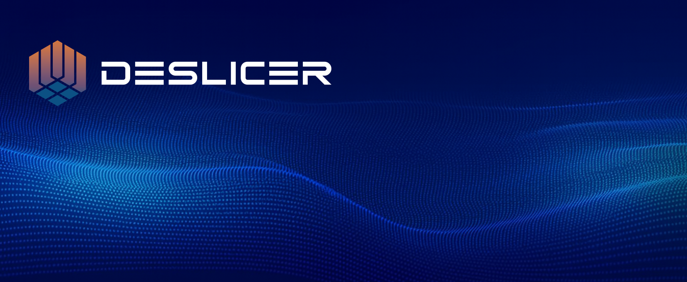

  

---

At **Deslicer**, we build products and solutions to help **you** get the most out of your Splunk investment.
Whether you represent a small business or a large enterprise, **Deslicer** helps you simplify the complexity around Splunk, accelerate data onboarding, and take control over app and configuration management, all within a fully consistent environment powered by our automation framework.

## Solution Areas

### Manage
Stop worrying about Splunk upgrades, configuration management, or security advisories. Join the growing base of users, the open-source framework [CCA for Splunk](https://github.com/deslicer/cca_for_splunk) has the essentials covered. When you need support and additional features, join our large customer community, where **Deslicer** solutions are essential in their daily operations.
Our biggest customers alone represent more than **€150B+ in combined revenue**, proving our impact at scale.

Splunk Enterprise, Splunk Cloud, or hybrid — we cover it all. And your voice guides our roadmap, shaping the features you need most, when no one else can deliver them.

### Develop
Democratize Splunk. Empower your users to do what they do best, managing their own apps and dashboards. **Deslicer DevOps** solutions enable effective CI/CD pipelines with guardrails built in. Managing several environments, countries, or regions? We’ve got you covered.

### Empower
Nothing is more important than maximizing the value of your investment. Eliminate onboarding queues, operate on an up-to-date, secure, and stable platform, and enjoy true resilience through full automation of data, platform, and developer processes.

## Technologies

Our technology stack combines:
- ⚙️ **Ansible-based orchestration** for scalable and reliable deployments
- 🖥️ **Developer and AI solutions** for efficiency and portability
- 🌐 **Cloud-native integrations** for CI/CD pipelines and enterprise workflows

Our solutions are trusted across **finance, manufacturing, telecom, fintech, and global enterprises** delivering consistency, security, and innovation at scale.

---

## 🌍 Where to Find Us

- 🌐 Website: [deslicer.com](https://deslicer.com)
- 🧑‍💻 GitHub: [github.com/deslicer](https://github.com/deslicer)
- 💼 LinkedIn: [Deslicer on LinkedIn](https://www.linkedin.com/company/deslicer)

---

## 🤝 Get Involved

We believe in the power of **open-source collaboration**.
Follow our work here on GitHub and join us in shaping the future of enterprise automation.

---